<h1 align="center">Forge Gym</h1>

<p align="center">
  A modern training app for gym members, built with Flutter for Android and iOS.<br/>
  Video-guided exercises · workout plans · your own routines · live sessions · challenges · progress.
</p>

<p align="center">
  
  
  
  
  
</p>

<p align="center">
  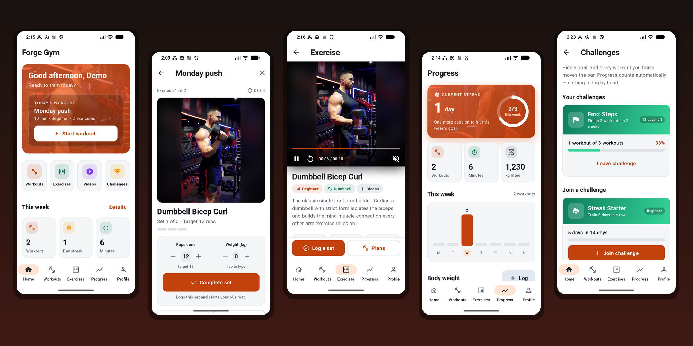
</p>

## Highlights

- **52 exercises with demo videos**, ordered beginner → advanced, with search and level / muscle / equipment filters.
- **Videos download on first open** and are cached on the phone, so the APK stays small and clips play offline afterwards.
- **A real video player**: tap for play/pause, scrubber, replay and mute; controls auto-hide; playback survives a phone call.
- **Guided live workouts**: reps, weight or hold timer per exercise, rest countdown with a "rest over" notification, and a session that survives the app being killed.
- **My routines**: build your own training diary — pick exercises, set sets / reps / rest, reorder, edit, delete — and train it like any plan.
- **Quick log**: record a set from any exercise page; it still counts towards stats and challenges.
- **Challenges that move by themselves**: join a goal and every finished workout updates the bar. Nothing is entered by hand.
- **Progress**: streak, weekly goal ring, animated stats, weekly chart, body-weight trend and history.
- **Firebase**: email/password accounts and push announcements, with local mocks for development and tests.

## Demo clips

Every exercise ships with a short demonstration. A few of them:

<p align="center">
  
  
  
  
</p>

The full-quality clips are served from GitHub Pages
([`MajidAli2006/forge-gym-media`](https://github.com/MajidAli2006/forge-gym-media)),
for example the
[barbell squat](https://majidali2006.github.io/forge-gym-media/exercises/squat-barbell/demo.mp4).
Each exercise also carries written steps, common mistakes and tips.

## Screens

| Home | Exercises | Exercise & video | Training videos |
|:---:|:---:|:---:|:---:|
| 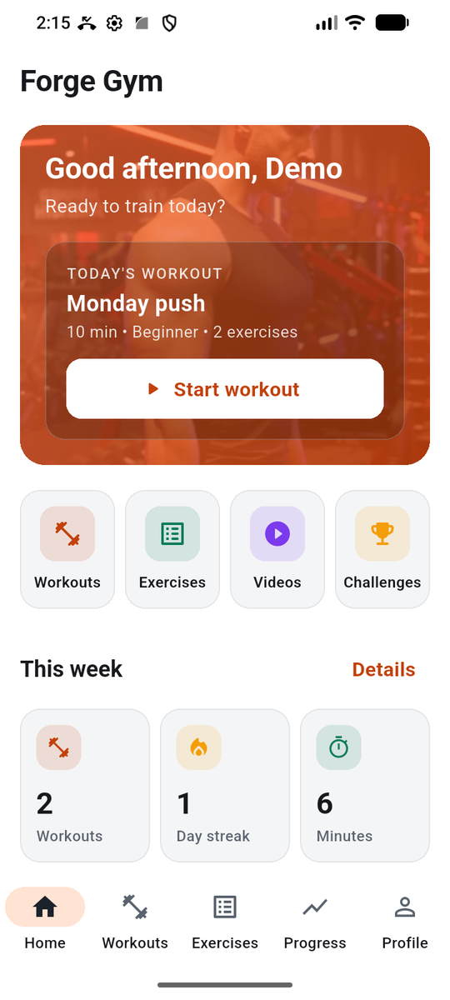 | 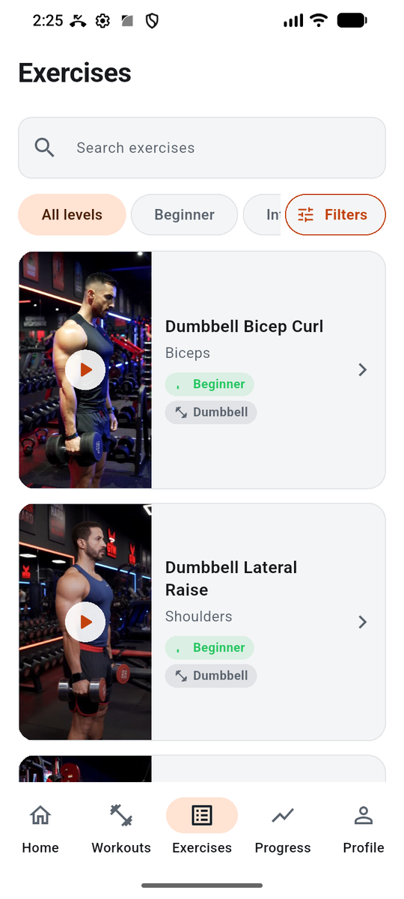 | 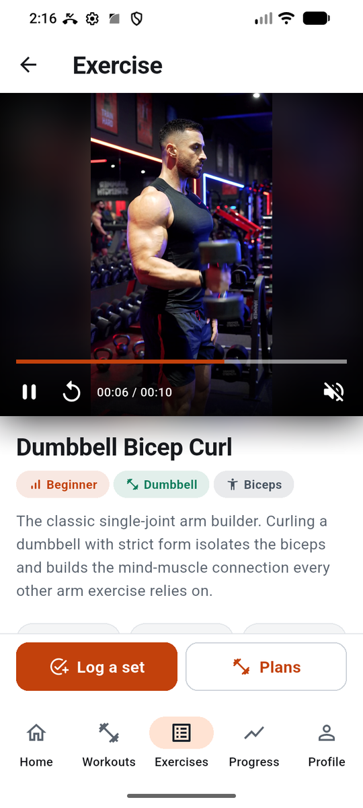 | 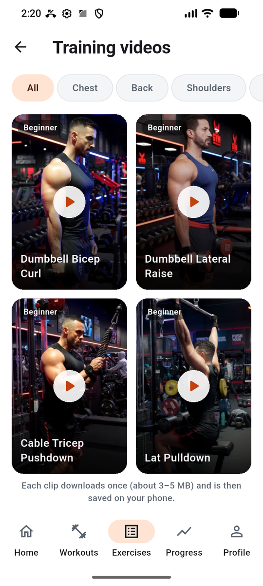 |

| Workouts & my routines | Routine detail | Live workout | Rest timer |
|:---:|:---:|:---:|:---:|
| 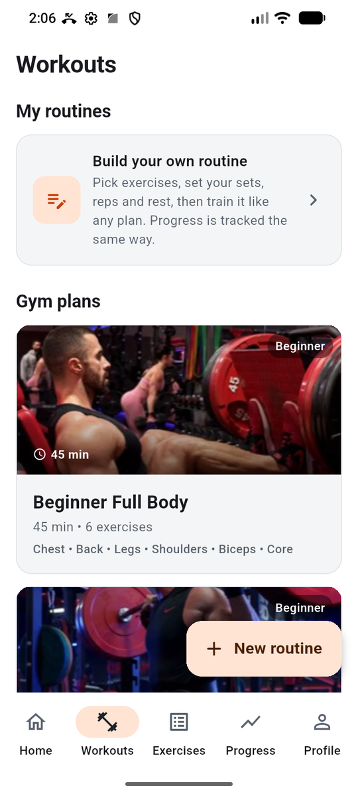 | 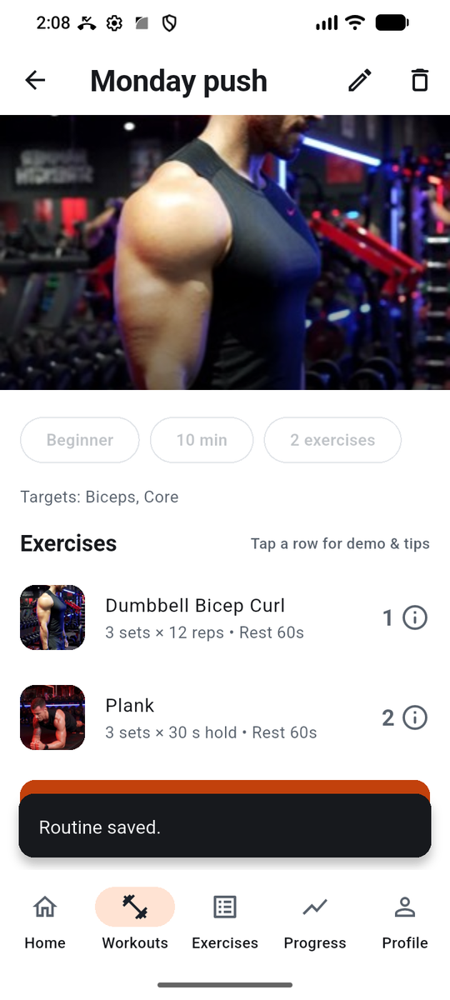 | 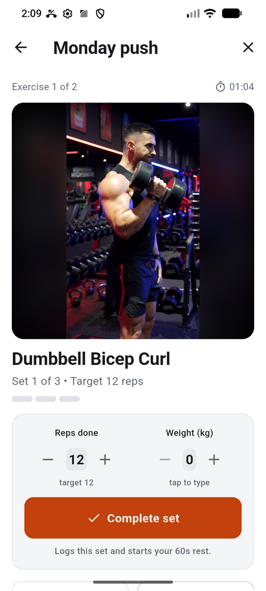 | 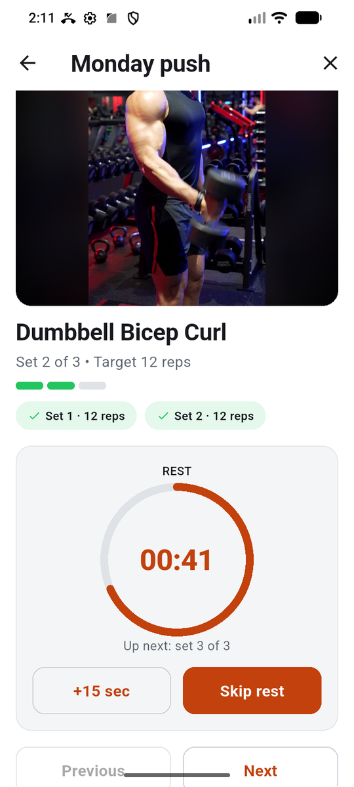 |

| Workout summary | Progress | Challenges | Profile |
|:---:|:---:|:---:|:---:|
| 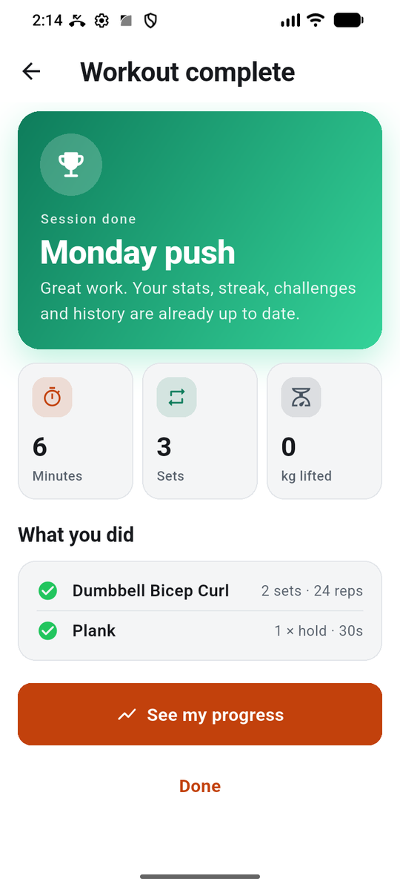 | 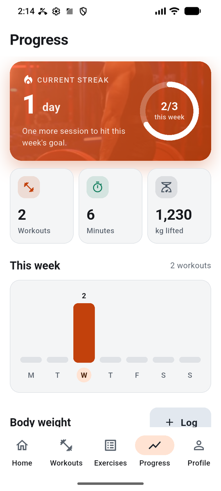 | 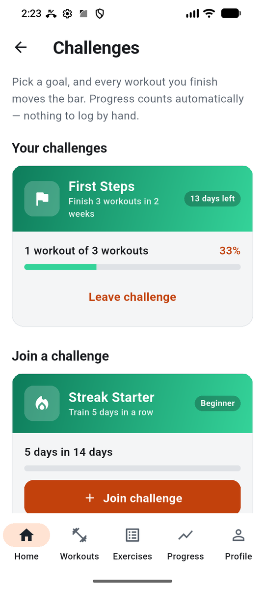 | 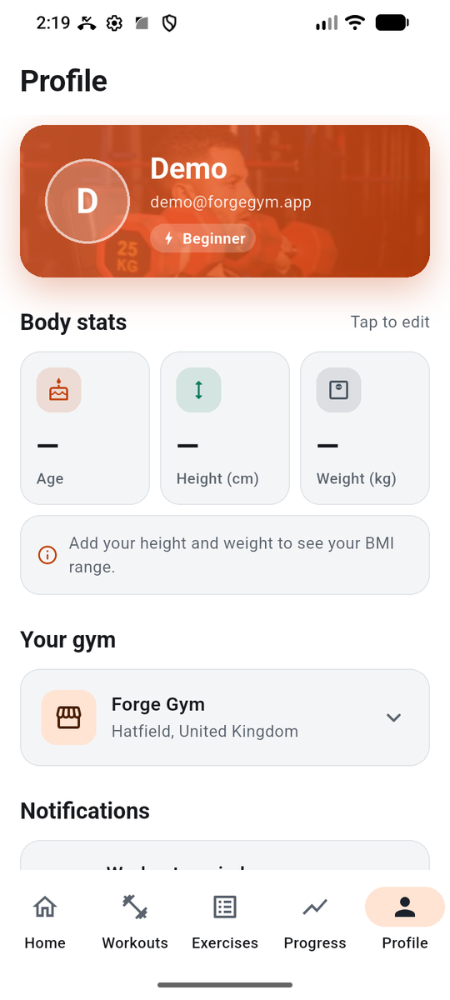 |

## Architecture

Clean architecture per feature, `data → domain → presentation`, with
repository interfaces in the domain layer so mock sources can be replaced by
an API without touching the UI.

```
lib/
  app/            bootstrap, environments, routing, dependency injection
  core/           media cache, notifications, firebase, errors, utils
  design_system/  theme, typography, motion, sheets, player, components
  features/       auth · home · exercises · workouts · challenges · progress · profile
```

- **State**: `flutter_bloc` (Cubit), one cubit per screen.
- **DI**: `get_it`, registered per feature.
- **Routing**: `go_router` with a stateful tab shell; the live workout and
  routine editor open above the tabs.
- **Cross-feature updates**: repositories expose change streams, so finishing
  a workout refreshes Home, Progress and Challenges in place.
- **Media**: `MediaCache` downloads to a temp file, renames on success,
  de-duplicates requests, reports progress and heals corrupt clips.
- **Quality**: strict lints, `flutter analyze` clean, 138 unit and widget tests.

Full details, package rationale and the navigation map are in
[`docs/ARCHITECTURE.md`](docs/ARCHITECTURE.md).

## Getting started

Requires Flutter 3.38 / Dart 3.10 or newer.

```bash
flutter pub get
flutterfire configure            # creates the git-ignored Firebase config files
flutter run --target lib/main_development.dart
```

The Firebase config files (`android/app/google-services.json`,
`ios/Runner/GoogleService-Info.plist`, `lib/firebase_options.dart`) are not
in the repository. `flutterfire configure` generates them for your own
Firebase project; enable Email/Password sign-in there.

The development flavor signs in against a local mock
(`demo@forgegym.app` / `password123`) and reads videos from a local server.
Point it at the hosted clips instead with:

```bash
flutter run --target lib/main_development.dart \
  --dart-define=MEDIA_BASE_URL=https://majidali2006.github.io/forge-gym-media
```

Other targets: `lib/main_staging.dart`, `lib/main_production.dart`.

## Checks

```bash
flutter analyze
flutter test
```

## Release builds

**Android** — one universal APK (about 27 MB, Android 5.0+):

```bash
flutter build apk --release --target lib/main_production.dart \
  --obfuscate --split-debug-info=build/symbols
```

Add `--split-per-abi` for ~11 MB per-ABI APKs, or use
`flutter build appbundle` for the Play Store. Builds are minified,
resource-shrunk and obfuscated; keep `build/symbols` for crash symbolication.
For store signing, copy `android/key.properties.example` to
`android/key.properties` and point it at your keystore.

**iOS**:

```bash
flutter build ipa --release --target lib/main_production.dart
```

Needs an Apple Developer team set in Xcode. Push notifications also need
the Push Notifications capability and an APNs key in Firebase.

## Hosting the videos

Clips are not bundled. They live on any static host laid out as
`exercises/<id>/demo.mp4`, and the app reads the base URL from
`MEDIA_BASE_URL`. GitHub Pages, Cloudflare Pages, Netlify and Supabase
Storage all work on their free tiers.

## Firebase

| Service | Used for |
|---|---|
| Authentication | email/password accounts (`FirebaseAuthRepository`) |
| Cloud Messaging | gym announcements on the `announcements` topic |

Firebase initialises best-effort at startup. When it is unavailable (tests,
missing config) the app falls back to local mocks.

## Known limitations

- Progress, routines and challenge enrolments are stored on the device, not
  synced to the account yet.
- Gym opening hours, facilities and rules in Profile are placeholder text.
- App name and bundle identifiers are working titles.
